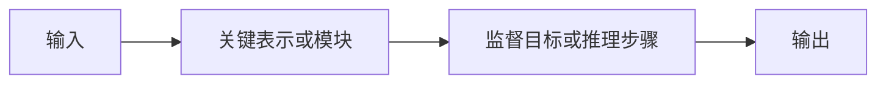

# 论文卡片：待填写

## AI 预读（允许自动填写）

- 任务设定：
- 作者声称的核心贡献：
- 作者报告的关键证据：
- 建议先看：Figure / Table / Equation / Page
- 来源核验：正式发表 / 预印本 / 未确认

## 1. 我的一句话总结（本人填写）

用“现有方法因为____而失败；本文通过____解决；证据是____”写一句话。

## 2. 问题、缺口与核心挑战（本人填写）

- 问题：
- 现有方法怎么做：
- 真正缺口：
- 根因或技术挑战：

## 3. 我重画的方法流程（本人填写）

不要照抄论文框架图。先关掉 PDF，再用自己的词修改下面的 Mermaid。

- 每个模块为什么需要：
- 训练和推理有什么不同：
- 去掉哪个模块最可能失败，为什么：

## 4. 证据与边界（本人填写）

- 最有说服力的实验：
- 这个实验真正证明了什么：
- 它没有证明什么：
- 最大弱点或替代解释：

## 5. 对我的研究主线的迁移（本人填写）

- 可迁移的机制：
- 对火灾/烟雾/极端退化环境的具体假设：
- 原任务与我的场景哪里不等价：
- 最小验证实验：
- 什么结果会否定这个想法：

## 6. 24 小时转化动作（本人填写）

- [ ] 阅读代码中的一个关键模块
- [ ] 复现一个最小组件或指标
- [ ] 写出一份带对照组的实验设计
- [ ] 明确记录“不采用该方法”的理由

只保留一个实际动作：

## 7. 未解决问题（本人填写）

1. 
2. 

## 完成检查

- [ ] 我能脱离摘要讲清问题、机制和证据
- [ ] 方法图是我自己重画的
- [ ] 我区分了作者报告与自己的推断
- [ ] 我写了可证伪的迁移假设
- [ ] 我安排了 24 小时转化动作
